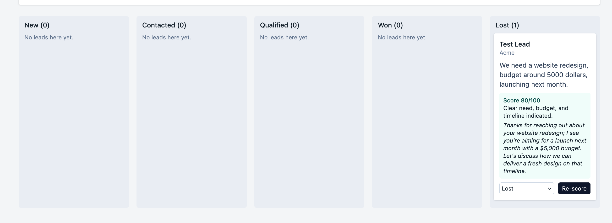

# NexusFlow

A small CRM for inbound leads. Add a lead, let an LLM score it and draft an opening email line, then move it through your pipeline on a Kanban board.

**Live demo:** https://nexusflow-ecru.vercel.app/
**Source:** https://github.com/hadeedramzan/nexusflow



## What it does

- Capture leads with a name, email, company and a message describing what they need
- Kanban board with five stages: New, Contacted, Qualified, Won, Lost
- "Qualify with AI" sends the lead to an LLM, which returns a score from 0 to 100, a one-sentence reason, and a short personalised icebreaker for a reply email
- All leads and AI results are stored in Postgres, so the board survives a refresh

## Stack

- **Frontend:** React 18, Vite, Tailwind CSS
- **Database:** Supabase (Postgres) with row level security enabled
- **AI:** Groq API, model `openai/gpt-oss-120b`, called with JSON output
- **Hosting:** Vercel (static frontend plus one serverless function)

## How it works

```text
Browser (React)
   |  insert / update / select leads
   v
Supabase (Postgres)

Browser --> POST /api/qualify (Vercel function) --> Groq API
                     |
                     v
            { score, reason, icebreaker }  --> saved back to the lead row
```

The Groq key lives only in the serverless function, so it is never exposed to the browser. The frontend talks to Supabase directly with the public anon key.

## Run locally

You need a free Supabase project and a free Groq API key.

1. Create the table by running `schema.sql` in the Supabase SQL editor.
2. Copy the env file and fill in your values:

```bash
cp .env.example .env
```

3. Install and start:

```bash
npm install
npm run dev
```

`npm run dev` runs the board only. The "Qualify with AI" button needs the serverless function, so to test it locally use the Vercel CLI (`vercel dev`) or test it on a deployed copy.

## Deploy

1. Push the repo to GitHub and import it in Vercel (Vite preset is detected automatically).
2. Add these environment variables before the first deploy: `VITE_SUPABASE_URL`, `VITE_SUPABASE_ANON_KEY`, `GROQ_API_KEY`.

## Known limits

This is a demo, not a production CRM.

- No authentication. The database policy in `schema.sql` allows anyone with the public key to read and write leads. Add Supabase Auth and per-user policies before real use.
- No rate limiting on the AI endpoint, so it is bounded only by the Groq free tier.
- Leads move between stages with a dropdown, not drag and drop.
- Scoring is a single LLM call on the lead's message. It does not look up the company or any outside data.
- No webhooks, notifications or email sending. The icebreaker is text you copy yourself.
- The score is an LLM judgement, not a calibrated model, so treat it as a triage hint.
